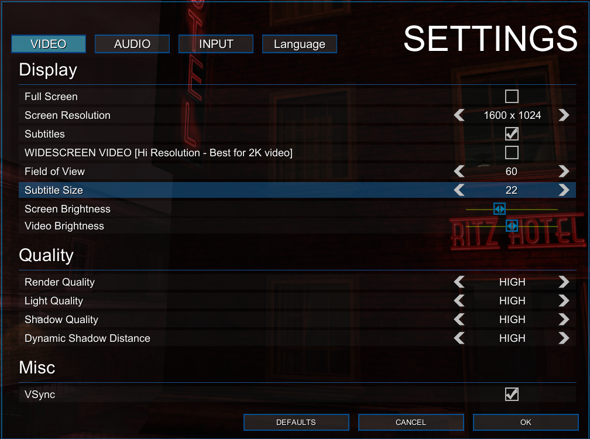

# Tesla Effect - Subtitle Size Patcher

This patcher modifies *Tesla Effect: A Tex Murphy Adventure* to add a native **"Subtitle Size"** option directly into the in-game Video Settings menu. No more squinting at tiny text!



## Features

- **Native Integration**: Adds a "Subtitle Size" stepper control to the game's Video Settings.
- **Wide Range**: Adjustable font sizes from **18 to 96** (in steps of 4).
- **Persistent**: Saves your preference to the game's player profile automatically.
- **Safe**: Creates an automatic backup of your original game file.
- **Themed Patcher**: Includes a "Smart Alex" themed CLI for the patching process.

## Comparison

| Before (Default Size) | After (Larger Size) |
| :---: | :---: |
|  |  |

## Installation

1.  **Download the latest release** from the [Releases page](../../releases).
2.  Extract `SubtitlePatcher.exe` to a convenient location.
3.  Open a terminal (cmd or PowerShell) or drag-and-drop the DLL onto the executable (if supported).
4.  Run the patcher with the path to your game's `Assembly-CSharp.dll`:

    ```powershell
    SubtitlePatcher.exe "C:\Program Files (x86)\Steam\steamapps\common\Tesla Effect\TeslaEffect_Data\Managed\Assembly-CSharp.dll"
    ```
    *(Note: Adjust the path if your Steam library is in a different location.)*

5.  **Smart Alex** will guide you through the recalibration process.
6.  Launch the game!

## Usage

1.  Go to **Options -> Video** in the game menu.
2.  Locate the new **Subtitle Size** option.
3.  Adjust the value to your liking.
4.  Click **OK** to apply.

## Uninstalling

1.  Navigate to `TeslaEffect_Data\Managed\` folder.
2.  Delete the patched `Assembly-CSharp.dll`.
3.  Rename `Assembly-CSharp.dll.backup` to `Assembly-CSharp.dll`.

## Troubleshooting

-   **Game Crashes?** Restore the backup file manually as described in "Uninstalling".
-   **Game Updated?** Steam updates will overwrite the patched file. Simply run the patcher again.

## Building from Source

Requirements:
-   .NET SDK 6.0 or higher

```powershell
dotnet build --configuration Release
```
